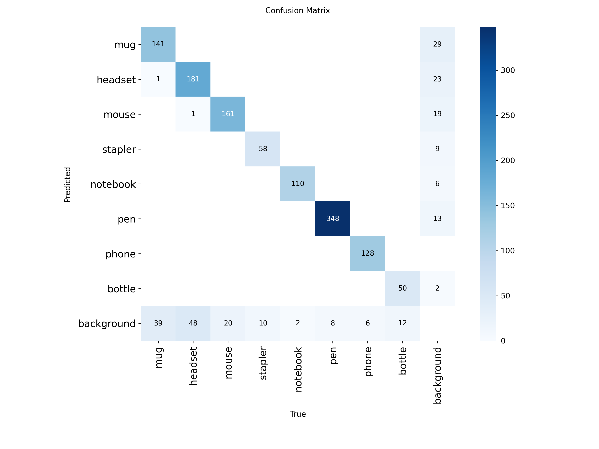

# Hot-Desk Office Item Classifier (Part B)

This repository contains the code, data pointers and notes for the Office-Goods classification component (Part B) of the PDE3802 coursework.

## 📦 Contents
- `src/demo_app.py` — Gradio demo app for inference.
- `data/data.yaml` — dataset configuration used for training.
- `models/hotdesk_final_model.pt` — trained YOLO11m weights (large file, add separately).
- `docs/DATASET_CARD.md` — dataset description.
- `docs/ERROR_ANALYSIS.md` — per-class and model error analysis.
- `docs/CHANGELOG.md` — project history.

## 🚀 Environment
- OS: Ubuntu 22.04.5 LTS
- GPU: AMD Radeon RX 6800 XT (16GB)
- ROCm: 6.0
- Python: 3.10.12
- PyTorch: 2.4.1+rocm6.0
- Ultralytics: 8.3.221

## 🧠 Training Overview
- Framework: YOLO11m (20.1M parameters)
- Dataset size: 8,345 labelled instances across 8 classes
- Phases:
  1. **Full dataset, heavy aug**
  2. **Fine-tune best weights**
  3. **'Mug' class micro fine-tune**

## 📊 Final Model Results
| Metric | Value |
|---------|--------|
| mAP50 | 0.939 |
| mAP50-95 | 0.758 |
| Precision | 0.935 |
| Recall | 0.909 |
| F1 Score | 0.922 |
| Macro-F1 | ≈ 0.920 |

Per-class AP50: mug 0.81, headset 0.85, mouse 0.94, stapler 0.99, notebook 0.99, pen 0.96, phone 0.99, bottle 0.98.




## 🧩 How to Run (For AMD GPU) [Tested]
```bash
python -m venv .venv
source .venv/bin/activate
pip install -r requirements-rocm.txt
python src/demo_app.py
```

## 🧩 How to Run (For CPU) [Partially-Tested]
```bash
python -m venv .venv
source .venv/bin/activate
pip install -r requirements-cpu.txt
python src/demo_app.py
```

## 🧩 How to Run (For Nvidia GPU) [Untested]
```bash
python -m venv .venv
source .venv/bin/activate
pip install -r requirements-cuda.txt
python src/demo_app.py
```

Results and plots are saved in `runs/detect/`.

# Troubleshooting Guide

This guide covers common issues and solutions for running the Hot-Desk Office Item Classifier.

## Table of Contents
- [Python & Virtual Environment Issues](#python--virtual-environment-issues)
- [Package Installation Issues](#package-installation-issues)
- [Model & Inference Issues](#model--inference-issues)
- [Gradio Web Interface Issues](#gradio-web-interface-issues)
- [Performance Issues](#performance-issues)
- [File Path Issues](#file-path-issues)
- [Common Error Messages](#common-error-messages)
- [Verification Commands](#verification-commands)

## Python & Virtual Environment Issues

### Virtual Environment Not Activating

**Linux:**
```bash
python -m venv .venv
source .venv/bin/activate
```

**Windows PowerShell**:
```bash
python -m venv .venv
.venv\Scripts\Activate.ps1
```

If PowerShell execution policy blocks:
```bash
Set-ExecutionPolicy -ExecutionPolicy RemoteSigned -Scope CurrentUser
```

### Python Not Found
```bash
# Check Python version
python3 --version

# Use python3 explicitly if needed
python3 -m venv .venv
source .venv/bin/activate
pip install -r requirements-cpu.txt
```

## Package Installation Issues

### ROCm Installation Fails
```bash
# Check ROCm compatibility
rocminfo

# If ROCm not detected, try environment variables:
export HSA_OVERRIDE_GFX_VERSION=10.3.0
export PYTORCH_ROCM_ARCH=gfx1030
pip install -r requirements-rocm.txt
```
For a clean install and how to get ROCm up and running, follow my guide: https://oubaidm.github.io/6800xt-rocm-guide/

### CUDA Installation Fails
```bash
# Check CUDA version
nvidia-smi

# For CUDA 11.8:
pip install torch torchvision --index-url https://download.pytorch.org/whl/cu118
```

### General Dependency Conflicts
```bash
# Clean installation
pip uninstall -r requirements-cpu.txt -y
pip install --upgrade pip
pip install -r requirements-cpu.txt

# Or try with no cache
pip install --no-cache-dir -r requirements-cpu.txt
```

## Model & Inference Issues

### Model File Not Found

    Ensure ```models/hotdesk_final_model.pt``` exists in your project root

    Download the model weights if missing (check README for download link)

### GPU Out of Memory
```bash
# Force CPU usage
python src/demo_app.py --device cpu

# Or reduce batch size
python src/demo_app.py --batch-size 4 # Can be 8 or 16. Depends on user's GPU
```

### ROCm Detection Issues
```bash
# Verify PyTorch can see ROCm
python -c "import torch; print(torch.cuda.is_available()); print(torch.version.hip)"
```

## Gradio Web Interface Issues

### Port Already in Use
```bash
# Use different port
python src/demo_app.py --port 7861

# Or specify host
python src/demo_app.py --host 0.0.0.0 --port 7860
```

### Gradio Interface Not Loading
```bash
# Check firewall settings
sudo ufw allow 7860

# Or try localhost only
python src/demo_app.py --host 127.0.0.1
```

## Performance Issues

### Slow Inference on CPU

Change in demo_app.py the imgsz to 320. Line 17 "Size"

## File Path Issues

### Dataset Path Errors
```bash
# Check data.yaml paths
cat data/data.yaml

# Ensure dataset directories exist
ls data/
```

### Permission Denied
```bash
# Fix file permissions
chmod +x src/demo_app.py
chmod -R 755 data/
```

## Common Error Messages

### "ModuleNotFoundError"
```bash
# Reinstall requirements
pip install -r requirements-cpu.txt --force-reinstall
```

### "CUDA out of memory"

Change at Line 67 in demo_app.py --> device=0 to device='cpu'

### "ROCm not available"

Change at Line 67 in demo_app.py --> device=0 to device='cpu'

Also, check ROCm installation:
```bash
/opt/rocm/bin/rocminfo
```

## Verification Commands

### Check Environments
```bash
python -c "import torch; print('PyTorch:', torch.__version__); print('CUDA available:', torch.cuda.is_available())"
```

### Check Model Loading
```bash
python -c "from ultralytics import YOLO; model = YOLO('models/hotdesk_final_model.pt'); print('Model loaded successfully')"
```

### Check Gradio
```bash
python -c "import gradio; print('Gradio:', gradio.__version__)"
```

### Check All Dependencies
```bash
python -c "
import torch
import ultralytics
import gradio
import numpy as np
import cv2
import PIL
print('All dependencies loaded successfully')
print('PyTorch:', torch.__version__)
print('Ultralytics:', ultralytics.__version__)
print('Gradio:', gradio.__version__)
"
```

## Platform-Specific Notes

### AMD/ROCm Users

    Tested on Ubuntu 22.04.5 LTS with ROCm 6.0

    Requires compatible AMD GPU (RX 6800 XT tested)

    Set environment variables if GPU not detected

    Visit: https://oubaidm.github.io/6800xt-rocm-guide/ For step-by-step on how I got my environment to work.

### NVIDIA/CUDA Users

    Requires CUDA-compatible NVIDIA GPU

    Untested but should work with recent CUDA versions

    Adjust CUDA version in requirements if needed


### CPU-Only Users

    Slower but reliable fallback

    No GPU dependencies

    Should work on any system with Python 3.8+


